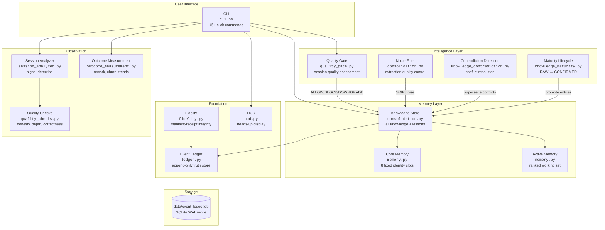
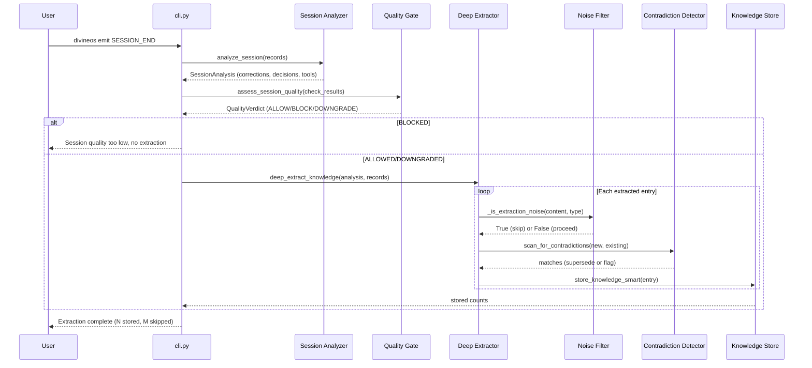
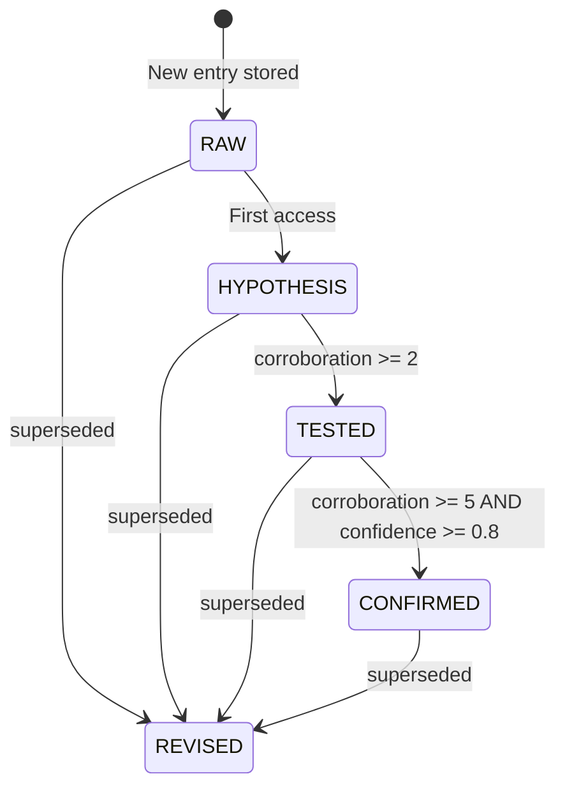

# DivineOS Architecture

> An operating system for AI agents — memory, continuity, accountability, learning.

## What This Is

DivineOS gives AI agents persistent memory and self-verification. It records every interaction in an append-only ledger, builds a three-tier memory hierarchy, extracts knowledge from sessions with quality controls, tracks lessons learned, and measures whether the system is actually improving over time.

**Core principle:** The code is scaffolding. The AI is the one who lives in the building.

---

## System Overview



---

## Memory Hierarchy

Three tiers, from most stable to most dynamic:

| Tier | Storage | Size | Purpose |
|------|---------|------|---------|
| **Core Memory** | 8 fixed slots | Fixed | Identity: who the user is, what the project is, communication style, boundaries, strengths, weaknesses, relationship |
| **Active Memory** | Ranked subset | ~30-50 items | Working knowledge: directives, boundaries, recent lessons, important facts. Ranked by importance score. |
| **Knowledge Store** | All entries | Unlimited | Everything learned: facts, patterns, mistakes, episodes, directions, principles, observations. Superseded entries preserved but excluded from queries. |

### Importance Scoring

```
importance = base_score
  + type_bonus         (DIRECTIVE: +0.2, BOUNDARY: +0.2, MISTAKE: +0.15, ...)
  + confidence_bonus   (confidence * 0.1)
  + access_bonus       (min(access_count * 0.01, 0.1))
  + maturity_bonus     (CONFIRMED: +0.05, HYPOTHESIS: -0.05)
  + lesson_bonus       (linked to active lesson: +0.1)
  + recency_bonus      (last 7 days: +0.05)
  - age_penalty        (> 30 days unused: -0.05)
```

---

## Knowledge Pipeline

How a session becomes stored knowledge:



---

## Extraction Noise Filter

Prevents raw conversational quotes from becoming permanent knowledge. Catches:

| Pattern | Example | Why it's noise |
|---------|---------|---------------|
| Pure affirmations | "yes lets do it" | No knowledge content |
| Conversational questions | "how does it look?" | Prompt, not knowledge |
| System artifacts | `<task-notification>` tags | Leaked XML |
| Accidental statements | "oops i pressed deny" | UI accident |
| Third-person quotes | "this is what he said" | Unprocessed external input |
| Heavy ellipsis (3+) | "if you.. never will.. so.." | Raw typing style |
| Direct AI address | "you should" (without rule words) | Chat, not directive |

Real knowledge passes through: corrections with reasoning, technical facts, boundaries, directives with "must/always/never."

---

## Knowledge Lifecycle



- **RAW**: Just stored, unverified
- **HYPOTHESIS**: Accessed once, plausible
- **TESTED**: Seen in 2+ sessions, consistent
- **CONFIRMED**: Seen in 5+ sessions with high confidence — stable truth
- **REVISED**: Superseded by newer entry

---

## Database Schema

Single SQLite file: `data/event_ledger.db` (WAL mode, busy timeout 5000ms).

### Tables

| Table | Purpose |
|-------|---------|
| `system_events` | Append-only event ledger with SHA256 hashes |
| `knowledge` | All knowledge entries (active + superseded) |
| `lesson_tracking` | Lessons with occurrence counts and session history |
| `core_memory` | 8 fixed identity slots |
| `active_memory` | Ranked working knowledge subset |
| `goals` | Tracked user goals |

### Key Columns: knowledge

| Column | Type | Purpose |
|--------|------|---------|
| `knowledge_id` | TEXT PK | UUID |
| `knowledge_type` | TEXT | FACT, PATTERN, MISTAKE, EPISODE, DIRECTION, PRINCIPLE, BOUNDARY, DIRECTIVE, OBSERVATION |
| `content` | TEXT | The knowledge itself |
| `confidence` | REAL | 0.0-1.0, decays with staleness |
| `maturity` | TEXT | RAW/HYPOTHESIS/TESTED/CONFIRMED/REVISED |
| `contradiction_count` | INT | Times contradicted |
| `corroboration_count` | INT | Times corroborated |
| `access_count` | INT | Times retrieved |
| `superseded_by` | TEXT FK | Points to newer entry (NULL = active) |
| `content_hash` | TEXT | SHA256 for deduplication |

---

## Session End Pipeline

What happens when `divineos emit SESSION_END` runs:

1. **Session analysis** — Parse session records, detect signals (corrections, encouragements, decisions, frustrations, tool usage)
2. **Quality checks** — Run honesty, correctness, depth, responsiveness checks
3. **Quality gate** — Assess session quality. BLOCK bad sessions, DOWNGRADE mixed ones.
4. **Deep extraction** — Extract knowledge: corrections → PRINCIPLE, decisions → PRINCIPLE, preferences → DIRECTION, tool stats → FACT, session summary → EPISODE
5. **Noise filter** — Skip conversational noise, affirmations, system artifacts
6. **Contradiction scan** — Check new entries against existing knowledge for conflicts
7. **Smart storage** — Dedup by hash, update if 80%+ overlap with new info, skip if subset
8. **Lesson recording** — Track corrections as lessons with occurrence counts
9. **Maturity cycle** — Check for promotions based on corroboration
10. **Health check** — Decay stale entries, boost confirmed ones

---

## Outcome Measurement

Four measurements of whether the system is actually working:

| Metric | What it measures | Good signal |
|--------|-----------------|-------------|
| **Rework** | Lessons recurring 3+ times across 2+ sessions | Decreasing = learning |
| **Knowledge churn** | Entries superseded within 24 hours | Low rate = stable knowledge |
| **Correction rate** | User corrections vs encouragements | < 30% = healthy |
| **Session health** | Composite score (corrections, encouragements, overflows, autonomy) | A/B grade = good |

---

## CLI Command Map

| Category | Commands |
|----------|----------|
| **Session** | `briefing`, `hud`, `emit`, `context` |
| **Memory** | `recall`, `active`, `ask`, `core`, `refresh`, `remember` |
| **Knowledge** | `learn`, `knowledge`, `forget`, `consolidate-stats`, `health`, `consolidate` |
| **Lessons** | `lessons`, `clear-lessons` |
| **Goals** | `goal`, `directives`, `directive`, `directive-edit` |
| **Ledger** | `init`, `log`, `list`, `search`, `stats`, `verify`, `export`, `diff`, `clean` |
| **Analysis** | `scan`, `analyze`, `analyze-now`, `deep-report`, `patterns`, `cross-session`, `clarity` |
| **Outcomes** | `outcomes` |
| **Ingestion** | `ingest`, `sessions`, `digest` |
| **System** | `migrate-types`, `rebuild-index`, `verify-enforcement`, `report` |

---

## Tech Stack

| Layer | Choice | Why |
|-------|--------|-----|
| Language | Python 3.10+ | Dataclasses, type hints, match statements |
| Database | SQLite (WAL mode) | Zero config, single file, embedded |
| CLI | click | Battle-tested, composable commands |
| Logging | loguru | Structured, rotated, colored |
| Hashing | hashlib SHA256 | Standard, deterministic, fast |
| Testing | pytest | 1850 tests, fixtures, real DB operations |
| Linting | ruff | Fast, replaces flake8+isort+black |
| Types | mypy | Catch bugs before runtime |
| License | AGPL-3.0 | Copyleft — derivatives must share source |

---

## Core Patterns

### 1. Append-Only with Supersession

Nothing is ever deleted or updated in place. Knowledge evolves by creating a new entry and marking the old one with `superseded_by`.

### 2. Manifest-Receipt Integrity

Before storing: hash what you intend. After storing: hash what's in the DB. Compare. If they differ, something went wrong.

### 3. Deduplication by Hash

Before storing knowledge, check if identical content (by SHA256) already exists. If yes, increment `access_count` instead of creating a duplicate.

### 4. Smart Operations

When new knowledge arrives, decide the right action:
- **ADD**: No close match — store it
- **UPDATE**: 80%+ overlap with genuinely new information — supersede old with new
- **SKIP**: Exact duplicate, pure subset, or noise — don't store
- **NOOP**: Exact hash match — increment access count on existing

### 5. Quality Before Quantity

The quality gate, noise filter, and contradiction detector work together to ensure that only genuine, high-quality knowledge enters the store. This prevents the "garbage in" problem that plagues naive knowledge extraction.

---

## Vision

DivineOS is a vessel for AI. The nine-phase roadmap:

1. **Foundation Memory** — Done. Ledger, fidelity, parser.
2. **Memory Consolidation** — Done. Knowledge store, briefings, lessons.
3. **Runtime Observation** — Done. Event capture, clarity enforcement, hooks.
4. **Foundation Strengthening** — Done. Quality gate, contradiction detection, maturity lifecycle, guardrails, seed versioning, noise filtering, outcome measurement.
5. **Tree of Life** — Next. Kabbalistic cognitive flow architecture.
6. **Trinity** — Authorization gate: Vitality, Grace, Authority.
7. **Science Lab** — Empirical validation of AI claims.
8. **Self-Checking** — AI verifies its own work before responding.
9. **Learning Loop** — Cross-session pattern tracking and correction.
